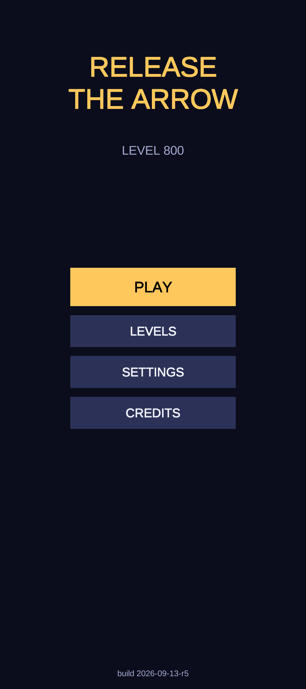
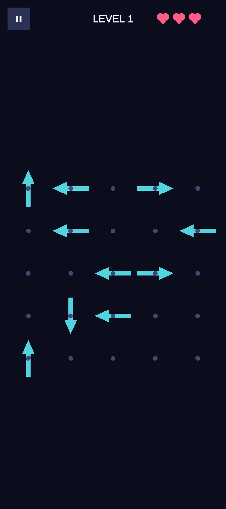
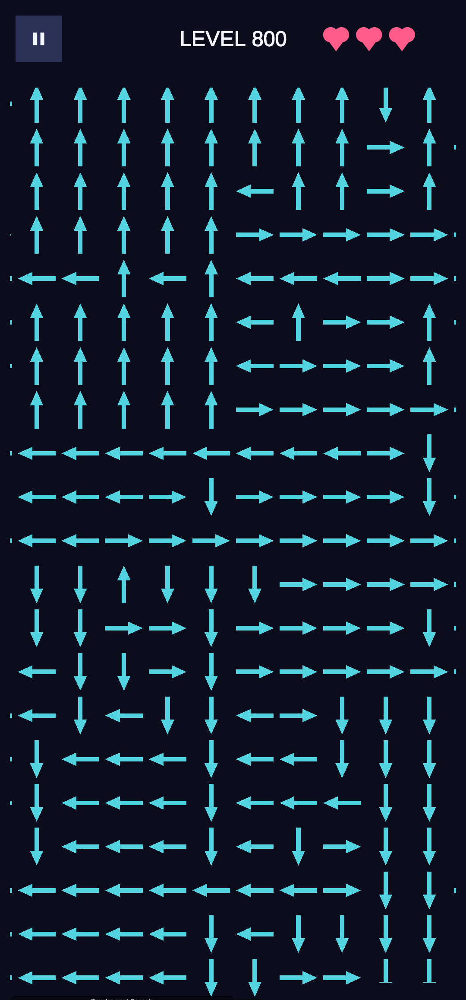
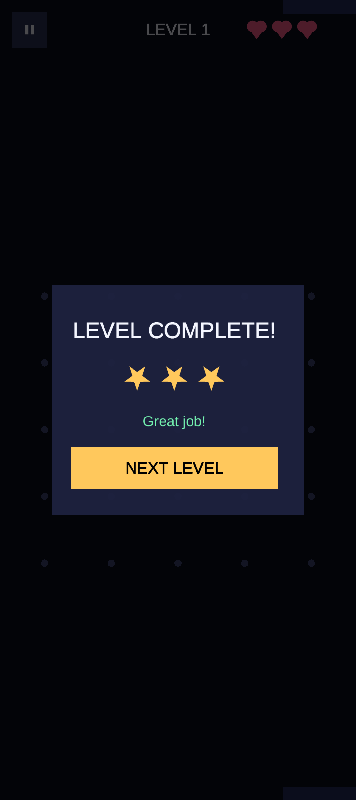

# Release the Arrow

A tap puzzle game for Android, built in Unity. Each level is a square grid of arrows, and each arrow points up, down, left or right. Tapping an arrow sends it off the board only if nothing is in its path. Tapping a blocked arrow costs one of your three lives. You clear a level by working out an order that releases every arrow. There are 1,500 levels. They are generated procedurally and checked to be solvable. Boards grow from 5x5 with 40% of cells filled at level 1 to a fully packed 80x80 board (6,400 arrows) from level 376 onward. Each level gives 1 to 3 stars based on how cleanly you cleared it. If you run out of lives, you can watch rewarded ads to continue from the same board position.

**Status:** Submitted to Google Play, in review.
Play Store: link coming once approved.

## Screenshots

  
  
  
  

## Tech

- Unity 6000.3.23f1 (`ProjectSettings/ProjectVersion.txt`), C#, uGUI, Unity Test Framework 1.5.1
- Android: package `com.virevia.releasethearrow`, min SDK 25, target SDK 36, IL2CPP, ARM64
- Google Mobile Ads Unity plugin 11.5.0 with Google UMP consent. It is turned on by the `RTA_ADMOB_SDK` scripting define. Without the define, a stub ad provider is used.
- No third-party art or audio. The UI, arrow graphics, app icon, feature graphic and sound effects are all generated in code.

## How it's built

All the code is in `Assets/_Project/Scripts/`, in the `ReleaseTheArrow.*` namespaces. There is one scene, `Assets/_Project/Scenes/Main.unity`, and it contains a single `GameFlowController`.

- **Level generation** (`Runtime/Generation/`). `LevelGenerator.cs` builds each level from its level ID using `DeterministicRandom`, so the same level always comes out the same. Instead of placing arrows and then searching for a solution, it simulates clearing the board. A cell can safely point left, right, up or down only if it is currently the outermost occupied cell in that direction along its row or column. The generator keeps these "frontier" cells in a list and tracks each row and column with doubly linked lists. It repeatedly picks a frontier cell at random, assigns it one of its safe directions, and removes it, updating the lists in O(1). Every arrow is safe when it is assigned, so every level is solvable by construction. There is no backtracking. `DifficultyCurve.cs` controls board size (one step larger every 5 levels), fill fraction (with a slight easing every 12th level) and a "locality bias". The locality bias makes removals cluster, which creates longer chains of arrows that depend on each other.
- **Solver** (`PuzzleSolver.cs`). Removing an arrow can only unblock other arrows, never block them, so a greedy pass is a complete solver. It is run on every generated level as a final check, and there is also a fallback layout.
- **Rules** (`Runtime/Gameplay/LevelSession.cs`). This is plain C# with no `MonoBehaviour`, so it can be unit tested directly. It handles lives, the continue table (the 1st, 2nd and 3rd continue need 1, 2 and 3 rewarded ads; after that you must restart), star rating, and `Restore()`. `Restore()` rebuilds a level that was in progress by replaying the saved order of removed arrows onto the regenerated layout.
- **Board** (`BoardState.cs`, `BoardController.cs`, `ArrowView.cs`, `BoardZoomController.cs`). Arrow views are pooled, and arrows and grid dots are drawn as vector meshes (`Runtime/UI/VectorShapes.cs`). A `ScrollRect` handles one-finger panning, and two-finger pinch zooms from 0.4x to 3x.
- **Persistence** (`Runtime/Save/`). A JSON save file (`JsonUtility`) stores level progress, best stars per level, settings and the current level in progress. Writes go to a temp file and are then swapped in with `File.Replace`. A version mismatch discards the saved in-progress attempt but keeps level progress.
- **Ads** (`Runtime/Ads/`). `AdManager.cs` talks to the interfaces in `AdProviderInterfaces.cs`, which `GoogleMobileAdsProvider.cs` or `StubAdProvider.cs` implement. It waits for UMP consent before starting, skips interstitials on levels 1 and 2, shows at most one interstitial every 30 seconds and only between levels, and plays rewarded ads one after another. The continue is granted only after every required ad has finished. Every call completes one way or the other, so gameplay never waits on an ad.
- **UI** (`Runtime/UI/`). `UIFactory.cs` builds every screen in code: menu, 1,500-level select, HUD, pause, settings, game over, level complete, credits and final completion. Buttons are wired only here, which avoids buttons firing twice from duplicate listeners.
- **Audio** (`Runtime/Audio/ProceduralAudioSynth.cs`). Sounds are generated at runtime from sine, square, triangle and noise waveforms.
- **Tests** (`Scripts/Tests/`). EditMode tests cover the board rules, the solver, whether every generated level is solvable, determinism, the difficulty curve, `LevelSession` (lives, continues, stars, restore) and `SaveData`. PlayMode tests start the real `GameFlowController`. The editor tool **Release The Arrow > Validate All 1500 Levels** (`Editor/LevelValidationTool.cs`) generates every level and runs the solver on it before a release.

## Notable problems solved

- **Level generator that couldn't fill large boards** (`0667222`, `91eb1bd`). The first generator placed arrows greedily and preferred the most constrained cells. The commit message records that it took 96 seconds to reach only 22% fill on an 80x80 board, because the cells it wanted ran out of valid directions as the board filled. I replaced it with a construction that peels the board ring by ring and fills every cell. That made the boards look like big uniform regions, so I then replaced it with the randomized frontier peel described above. The commit message reports about 18 ms in the worst case per 80x80 level.
- **Arrows drawn in a different direction from their logic** (`0051376`, `52c079e`, `846fc38`). Unity's UI Z rotation turns clockwise on screen, so Left and Right were drawn swapped. The sprite rasterizer also flipped the base glyph vertically, which needed compensating rotation angles. When the raster sprites were later replaced with correctly oriented meshes, those angles were never reverted, so every arrow was drawn 180 degrees off while the release logic (which reads `spec.direction`) was still correct. I found it by stepping through a screen recording frame by frame and checking all 25 cells against the generator's layout. I also added a build stamp on the main menu (`Core/BuildInfo.cs`) so bug reports can name the exact build.
- **Pooled animation callbacks acting on recycled views** (`2564330`). If a board was restarted while a release animation was still running, the pooled `ArrowView` could be given to a new arrow, and then the old tween's callback would hide it or release it a second time. `ArrowView` now has a generation counter that each callback checks before doing anything.
- **Save file safety** (`2564330`). The save used to delete the old file and then move the new one into place, so for a moment neither file existed. That moment was exactly when `OnApplicationPause` was most likely to be followed by the OS killing the app. It now uses `File.Replace`. The same commit fixed a finished level being marked as in progress again, and made a corrupt in-progress save recover instead of crashing the Play button.
- **UI elements collapsing to zero size** (`f794c2d`). Children of layout groups are sized through `ILayoutElement`, not `sizeDelta`, so almost every menu rendered as a pile of overlapping elements. `UIFactory` now adds a `LayoutElement` to each one. The level-select grid overflowed into the pagination footer, so it moved into a `ScrollRect`. Automated tests never render a layout, so these only showed up once the game ran on an emulator.
- **HUD drawn mid-screen** (`f212ea8`). `SafeAreaFitter` overwrites its object's anchors with the safe-area rectangle. That is correct for a root that stretches across the screen, but it had been put on the HUD's top strip and wiped out its anchoring.
- **UMP consent crash** (`37c80aa`). Logcat showed that consent callbacks came from a native SDK thread, and `AdManager` created a GameObject in response, which throws off the main thread. `ConsentManager` now captures `SynchronizationContext.Current` on the main thread and sends every completion back through it.

## Open and build locally

1. Install Unity 6000.3.23f1 with Android Build Support.
2. In Unity Hub, add this folder as a project and open `Assets/_Project/Scenes/Main.unity`. If the scene is missing or broken, **Release The Arrow > Rebuild Main Scene** recreates it.
3. Press Play to run it in the editor. Run the tests from **Window > General > Test Runner** (EditMode and PlayMode).
4. To build, use the **Release The Arrow** menu:
   - **Build Android Debug APK** (`Editor/DebugBuildScript.cs`): for installing on a device or emulator.
   - **Build Android Release (.aab)** (`Editor/BuildScript.cs`): writes `Builds/Android/ReleaseTheArrow.aab`. Signing comes only from the `RTA_KEYSTORE_PATH`, `RTA_KEYSTORE_PASSWORD`, `RTA_KEY_ALIAS_NAME` and `RTA_KEY_ALIAS_PASSWORD` environment variables. The keystore is not committed. Without those variables, you get a bundle without a release signature. The batch-mode command is in the header comment of `BuildScript.cs`.
   - **Ads > Enable/Disable Real AdMob SDK** switches the `RTA_ADMOB_SDK` define. With it off, the game uses the stub ad provider.

## Docs

- [StoreListing/store_listing.md](StoreListing/store_listing.md): Play Store copy, content rating and data safety notes
- [StoreListing/privacy_policy.md](StoreListing/privacy_policy.md): privacy policy (hosted from [docs/index.html](docs/index.html) via GitHub Pages)
